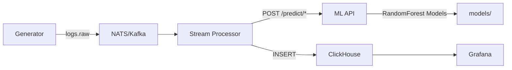

# Issues & Hướng Cải Thiện Dự Án Big Data (Ngoài ML)

---

## ISSUE-1: ClickHouse tables không có partitioning

**Mức độ:** Cao
**File liên quan:** `analytics/sql/create_processed_logs.sql`

### Vấn đề
Tất cả 4 bảng (`processed_logs`, `bot_feature_windows`, `load_forecasts`, `anomaly_alerts`) đều dùng `ENGINE = MergeTree()` mà không có `PARTITION BY`. Khi dữ liệu lớn, mọi query sẽ scan toàn bộ table, performance giảm nghiêm trọng.

### Hướng cải thiện
```sql
-- Thêm partitioning theo tháng
ENGINE = MergeTree()
PARTITION BY toYYYYMM(timestamp)
ORDER BY (timestamp, ip, request_id);

-- Thêm TTL để tự động xóa dữ liệu cũ
TTL timestamp + INTERVAL 30 DAY;
```

### Impact
- Giảm 70-90% data scan cho các query theo thời gian
- Tiết kiệm disk khi có TTL
- Dễ dàng drop partition cũ thay vì DELETE

---

## ISSUE-2: Không có Materialized Views cho aggregation ✅ ĐÃ GIẢI QUYẾT

**Mức độ:** Cao
**File liên quan:** `analytics/sql/create_materialized_views.sql`, `analytics/scripts/ensure_seed.py`

### Vấn đề
Grafana dashboard phải query raw data mỗi lần refresh. Không có pre-aggregated tables cho các metric thường dùng như: bot count theo giờ, avg latency theo endpoint, error rate theo thời gian.

### Hướng cải thiện
```sql
-- Materialized view cho bot stats theo giờ
CREATE MATERIALIZED VIEW bot_stats_hourly
ENGINE = SummingMergeTree()
PARTITION BY toYYYYMM(hour)
ORDER BY (hour, ip)
AS SELECT
    toStartOfHour(window_end) AS hour,
    ip,
    sum(is_bot) AS bot_count,
    avg(bot_score) AS avg_bot_score,
    sum(number_of_requests) AS total_requests
FROM bot_feature_windows
GROUP BY hour, ip;
```

### Impact
- Dashboard load nhanh hơn 10-100x
- Giảm tải cho ClickHouse
- Grafana queries đơn giản hơn

---

## ISSUE-3: Spark Session được tạo/dừng mỗi batch ✅ ĐÃ GIẢI QUYẾT

**Mức độ:** Nghiêm trọng
**File liên quan:** `stream-processor/src/stream_processor/main.py`

### Vấn đề
Trong `build_bot_feature_windows_spark` và `build_anomaly_feature_windows_spark`, SparkSession được tạo mới và stop sau mỗi lần gọi:
```python
spark = SparkSession.builder.master("local[1]").appName("aiops-bot-window").getOrCreate()
# ... processing ...
spark.stop()
```
Việc khởi động Spark JVM mất 5-15 giây mỗi lần — hoàn toàn không acceptable cho streaming.

### Giải pháp đã thực hiện
- Singleton pattern: `get_spark_session()` khởi tạo 1 lần, reuse giữa các batch
- `shutdown_spark_session()` chỉ gọi khi process shutdown (KeyboardInterrupt)
- Fallback tự động từ Spark → Python khi Spark không khả dụng (try/except trong `build_bot_feature_windows` và `build_anomaly_feature_windows`)
- Cấu hình tối ưu: `local[2]`, `spark.sql.shuffle.partitions=4`, `spark.ui.enabled=false`

### Impact
- Giảm latency mỗi batch từ 5-15s xuống <1s (sau lần khởi tạo đầu tiên)
- Tiết kiệm CPU/RAM do không phải khởi động JVM liên tục

---

## ISSUE-4: Stream state quản lý trong memory — mất khi crash ✅ ĐÃ GIẢI QUYẾT

**Mức độ:** Trung bình
**File liên quan:** `stream-processor/src/stream_processor/main.py`

### Vấn đề
`RuntimeState` lưu `recent_events` và `traffic_buckets` trong RAM. Nếu process crash hoặc restart:
- Mất toàn bộ window state
- Mất lịch sử forecast
- Dữ liệu trong cửa sổ hiện tại bị tính sai

### Giải pháp đã thực hiện
- **File-based checkpoint** với atomic write (write `.tmp` → rename)
- `save_checkpoint(state, path)` — serialize `recent_events` + `traffic_buckets` ra JSON
- `load_checkpoint(path)` — restore state từ file, parse lại datetime
- Tự động load checkpoint khi `main()` khởi động
- Periodic checkpoint mỗi `STREAM_CHECKPOINT_INTERVAL` giây (default: 30s)
- Save checkpoint khi nhận `KeyboardInterrupt` (graceful shutdown)
- Configurable qua `STREAM_CHECKPOINT_PATH` và `STREAM_CHECKPOINT_INTERVAL` env vars
- Corrupt checkpoint file → gracefully fallback về fresh state (không crash)

### Impact
- Pipeline recover được sau crash
- Không mất window state
- Đảm bảo tính liên tục của forecasting

---

## ISSUE-5: Không có watermarking cho late-arrival events

**Mức độ:** Trung bình
**File liên quan:** `stream-processor/src/stream_processor/main.py`

### Vấn đề
Pipeline không xử lý trường hợp events đến muộn (late arrival). Nếu một event có timestamp cũ hơn window hiện tại > 60s, nó sẽ bị bỏ qua hoặc tính sai window.

### Hướng cải thiện
- Thêm watermark configuration: `WATERMARK_DELAY_SECONDS=120`
- Reject hoặc route events quá cũ vào dead letter queue
- Document rõ đây là "at-least-once" processing với watermark

```python
def is_too_late(event_time: datetime, latest_time: datetime, watermark_seconds: int) -> bool:
    return (latest_time - event_time).total_seconds() > watermark_seconds
```

### Impact
- Xử lý đúng các edge cases trong production
- Tránh data corruption do late events

---

## ISSUE-6: Generator dữ liệu quá đơn giản

**Mức độ:** Trung bình
**File liên quan:** `generator/src/generator/main.py`

### Vấn đề
- Chỉ có ~9 IP (5 human + 4 bot)
- Pattern cứng nhắc theo `phase % 24`
- Batch size mặc định chỉ 5 records
- Không simulate được real-world traffic patterns

### Hướng cải thiện
- Tăng số lượng IP lên hàng nghìn (generate dynamically)
- Thêm realistic traffic patterns: daily seasonality, weekly patterns, random spikes
- Thêm khả năng configure traffic volume qua env vars
- Nhấn mạnh `replay_access_logs.py` cho replay từ log thật

```python
# Generate IPs dynamically
def generate_ip_pool(size: int) -> list[str]:
    return [f"{random.randint(1,254)}.{random.randint(0,255)}.{random.randint(0,255)}.{random.randint(1,254)}" for _ in range(size)]
```

### Impact
- Dữ liệu realistic hơn để demo
- Test được scalability của pipeline
- Phát hiện được bugs mà dữ liệu nhỏ không expose

---

## ISSUE-7: Không có structured logging

**Mức độ:** Trung bình
**File liên quan:** Toàn bộ các file `main.py`

### Vấn đề
Tất cả logging đều dùng `print()`:
```python
print(f"Published {len(logs)} v2 raw logs to {settings.subject}")
print(f"Processed {status['count']} raw logs from {status['source']}...")
```
Không có log level, không có timestamp, không có structured format — rất khó debug trong production.

### Hướng cải thiện
```python
import logging
import json

logging.basicConfig(
    level=logging.INFO,
    format='{"timestamp":"%(asctime)s","level":"%(levelname)s","module":"%(name)s","message":"%(message)s"}',
)
logger = logging.getLogger("stream-processor")

logger.info("Processed logs", extra={
    "count": status["count"],
    "source": status["source"],
    "sink": status["sink"],
    "bot_windows": status["bot_windows"],
})
```

### Impact
- Debug dễ dàng hơn
- Có thể ship logs đến ELK/Loki
- Monitoring và alerting dựa trên log patterns

---

## ISSUE-8: Không có metrics / monitoring

**Mức độ:** Trung bình
**File liên quan:** Toàn bộ pipeline

### Vấn đề
Không có cách nào để biết:
- Pipeline đang xử lý bao nhiêu records/sec?
- ML API latency là bao nhiêu?
- Error rate của các component?
- ClickHouse ingestion rate?

### Hướng cải thiện
- Thêm Prometheus metrics (dùng `prometheus-client` library)
- Expose `/metrics` endpoint trên mỗi service
- Grafana đã có sẵn, chỉ cần thêm Prometheus datasource

```python
from prometheus_client import Counter, Histogram, start_http_server

records_processed = Counter('stream_records_processed_total', 'Total records processed', ['source'])
processing_latency = Histogram('stream_processing_latency_seconds', 'Processing latency')

def process_once(...):
    with processing_latency.time():
        # ... processing ...
        records_processed.inc(len(raw_logs), source="nats")
```

### Impact
- Biết được health của pipeline real-time
- Phát hiện performance degradation sớm
- Có số liệu để báo cáo đồ án (throughput, latency, error rate)

---

## ISSUE-9: Thiếu integration tests

**Mức độ:** Cao
**File liên quan:** `tests/`

### Vấn đề
Chỉ có unit tests. Không có test nào chạy toàn bộ pipeline end-to-end:
- Generator → NATS → Stream Processor → ML API → ClickHouse
- Không test được interaction giữa các components
- Không có load/stress tests

### Hướng cải thiện
- Thêm integration test với Docker Compose (start toàn bộ stack, send test data, verify ClickHouse)
- Thêm test cho Spark path (`use_spark_windows=True`)
- Thêm simple load test (send 10K records, verify tất cả được xử lý)

```python
def test_end_to_end_pipeline():
    # Start all services via docker-compose
    # Send 100 test records to NATS
    # Wait for processing
    # Query ClickHouse to verify data
    # Assert bot predictions exist
    # Assert forecast records exist
    # Assert anomaly alerts exist
```

### Impact
- Tự tin hơn khi refactor code
- Phát hiện regression sớm
- Chứng minh pipeline hoạt động đúng khi demo

---

## ISSUE-10: Không có architecture diagram

**Mức độ:** Thấp
**File liên quan:** `docs/`, `README.md`

### Vấn đề
Toàn bộ documentation là text. Không có hình ảnh minh họa kiến trúc, data flow, hoặc component diagram. Giảng viên/chấm điểm thường muốn nhìn diagram trước khi đọc code.

### Hướng cải thiện
- Tạo architecture diagram (dùng Draw.io, Excalidraw, hoặc Mermaid)
- Thêm sequence diagram cho data flow
- Thêm deployment diagram



### Impact
- Dễ hiểu cho người mới
- Ấn tượng khi trình bày/bảo vệ đồ án
- Reference tốt cho team

---

## ISSUE-11: Bảo mật cơ bản

**Mức độ:** Thấp
**File liên quan:** `infra/docker-compose.yml`, `ml-api/src/ml_api/main.py`

### Vấn đề
- Grafana default credentials: `admin/admin`
- ML API không có authentication
- ClickHouse không có password
- Không có rate limiting

### Hướng cải thiện
- Dùng `.env` cho credentials (đã có `.env.example` — tốt)
- Thêm API key cho ML API endpoints
- ClickHouse: thêm password cho default user
- Thêm rate limiting cho ML API (dùng `slowapi` cho FastAPI)

### Impact
- Production-ready hơn
- Tránh bị abuse khi expose ra network

---

## ISSUE-12: Không có performance benchmarks

**Mức độ:** Trung bình
**File liên quan:** `docs/`, `README.md`

### Vấn đề
Không có số liệu nào về:
- Pipeline xử lý được bao nhiêu records/sec?
- End-to-end latency từ generator → ClickHouse là bao nhiêu?
- Memory footprint của toàn bộ stack?

### Hướng cải thiện
- Tạo benchmark script
- Đo throughput với various batch sizes
- Đo latency p50, p95, p99
- Ghi kết quả vào docs/BENCHMARKS.md

```
Benchmark results (local, M2 MacBook Pro):
- Throughput: 500 records/sec (batch_size=50, Python windowing)
- End-to-end latency: p50=2.1s, p95=4.3s, p99=6.8s
- Memory: NATS=128MB, ClickHouse=512MB, Grafana=256MB, Stream=200MB, ML=150MB
```

### Impact
- Có số liệu concrete để báo cáo
- Biết được giới hạn của pipeline
- Cơ sở để optimize

---

## TỔNG KẾT

| Priority | Issue | Effort | Impact |
|----------|-------|--------|--------|
| P0 | ISSUE-3: Spark Session singleton | Thấp | Nghiêm trọng |
| P0 | ISSUE-1: ClickHouse partitioning | Thấp | Cao |
| P0 | ISSUE-9: Integration tests | Trung bình | Cao |
| P1 | ISSUE-2: Materialized Views | Trung bình | Cao |
| P1 | ISSUE-8: Metrics/Monitoring | Trung bình | Cao |
| P1 | ISSUE-12: Performance benchmarks | Thấp | Trung bình |
| P2 | ISSUE-4: State persistence | Cao | Trung bình |
| P2 | ISSUE-6: Generator cải thiện | Trung bình | Trung bình |
| P2 | ISSUE-5: Watermarking | Trung bình | Trung bình |
| P3 | ISSUE-7: Structured logging | Thấp | Trung bình |
| P3 | ISSUE-10: Architecture diagram | Thấp | Thấp |
| P3 | ISSUE-11: Bảo mật | Trung bình | Thấp |
